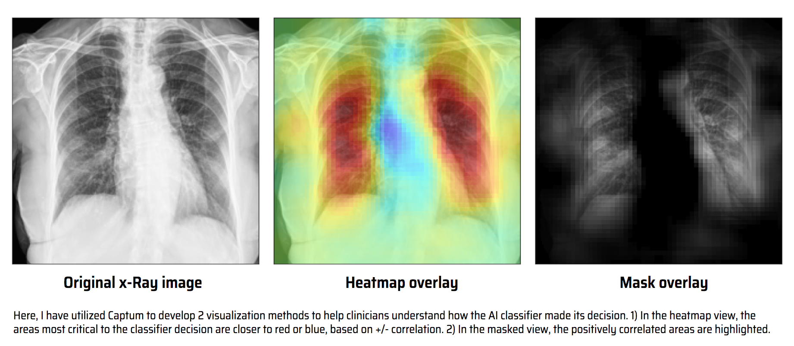
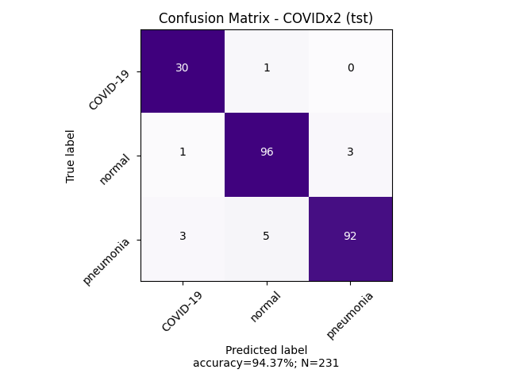
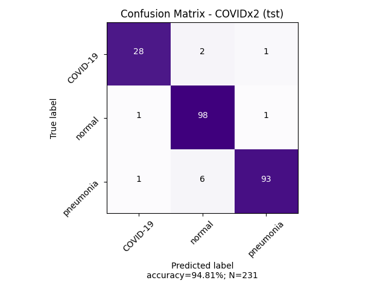

# COVIDNet-CXR-Shuffle
This is an open-source DL-based classification model that tries to identify patients with COVID-19 viral infection, non-COVID-19 infection, and those with no infection with high accuracy by analyzing their chest x-ray scans. This project is part of [COVID-Net](https://github.com/lindawangg/COVID-Net) open source initiative. This is a prototype model, not intended to be used yet in production. You can reach out to me directly on [LinedIn](https://www.linkedin.com/in/aalhaimi1/) if you have questions about this model or want help to getting it used as an experimental tool for COVID-19 near real-time screening.

--
Key points on COVIDNet-CXR-Shuffle network
--
1. The architecture was adapted from [ShuffleNet v2](https://arxiv.org/abs/1807.11164)
2. Designed with efficiency in mind to allow *near real-time screening* with mobile devices
3. Experimented with *transfer learning* and *data augmentation* techniques to improve generalizability and robustness
4. This project is built using open-source software, where [PyTorch](https://pytorch.org/) was used as the main AI framework
5. Training and testing datasets relied on COVIDx dataset which consists of chest x-ray images from 3 publicly available data.
6. For model evaluation, I relied on the images listed in `test_COVIDx2.txt` as the blind testset used for evaluation.

Project structure
--
- `data` directory contains 3 important scripts:
    - `create-db.py` is a slightly modified verion of the original instructions that was used to get the main `train` and `test` datafolders. Make sure you do this first.
    - `create-trainsets.py` is uesed to create the `trainset` which includes `trn` and `val` subfolders with images arranged by class. There is code that can be used to get a balanced version of the data that you can later on pass directly to an augmentation method. 
    - `create-covidx2-testset.py` is used to get the `COVIDx2_test` dataset which this and the other COVIDNet models use as a blind testset
    - `train_split_v3.txt` contains the list of images used to create the `trainset`. The `test_split_v3.txt` was never used since `test_COVIDx2.txt` is a subset of it.
    - For more details on COVIDx dataset and the original instructions, checkout the [COVID-Net repo](https://github.com/lindawangg/COVID-Net).

- `models` directory contains the pretrained models.
- project requirements can be found in `requirements.txt`.
- `train.py` contains the entire training pipeline, which includes dataloaders, preprocessing, augmentations, hyperparameters, main train loop, and model saving mechanism. 
- `test.py` contains a simple prediction script that reads a directory of images created by `create-covidx2-testset.py`.

Performance metrics and benchmarks
--
- covidnet-cxr-shuffle-e18

- covidnet-cxr-shuffle-e35 

